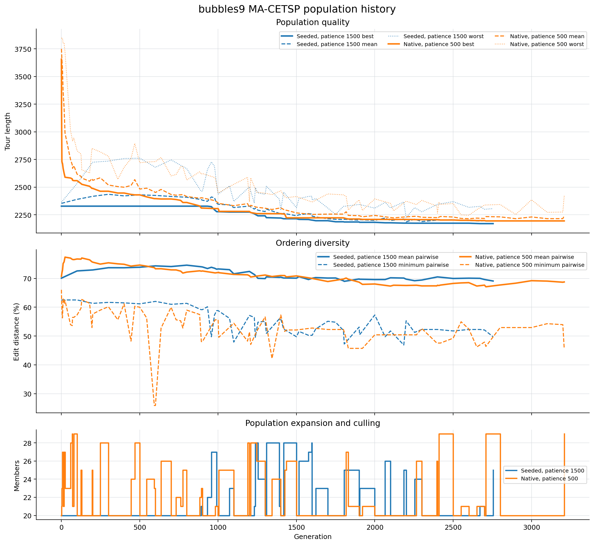
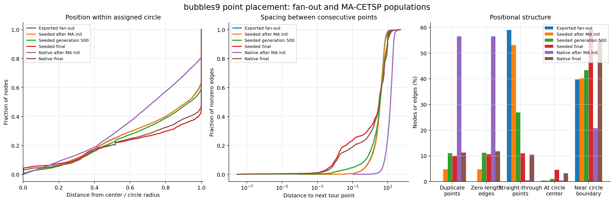

# Mennell hybrid results

## Twenty-run seeded protocol

Each of the 62 Mennell instances received 20 independent MA-CETSP runs. Each
initial population contained 20 tours selected from 1,000 construction runs;
`bonus1000` used 10,000. MA-CETSP used population 20, 5,000 generations,
fitness weight 0.96, edit-distance threshold 5, neighbor size 50, and a
36,000-second limit. Seeded populations had 1,500 generations to find their
first improvement, followed by the standard 500-generation stagnation limit.
Every result received a fixed-order SOCP pass.

Against [Lei and Hao's published values](https://leria-info.univ-angers.fr/~jinkao.hao/papers/LeiHaoASC2024.pdf),
at each value's published precision, the best-of-20 results contain **17
improvements, 31 ties, and 14 losses**. All
1,240 final tours passed coverage validation against the original, unreduced
instances; all 62 retained best-result files also passed a separate validation
pass.

The archived Lei--Hao tours in `data/mennell/reference_tours` were also checked
directly.
Their coordinates were written with six significant digits, so only 10 of the
62 raw exports pass strict coverage validation; the largest boundary correction
needed for the remaining files is 0.000614 coordinate units. After projecting
the rounded visits back into their assigned disks and applying fixed-order SOCP,
all 62 reconstructed references are valid and all 17 hybrid improvements remain
shorter. Eight improvements exceed 0.01%; the other nine are smaller but are not
artifacts of comparing against the rounded headline values alone. The complete
audit is in [`reference_tour_audit.csv`](./tables/reference_tour_audit.csv).

| Instance | Seeded best | Lei-Hao | Improvement |
|---|---:|---:|---:|
| `bonus1000` | 376.667789 | 384.365 | 2.0026% |
| `rd400_or10` | 448.455209 | 452.826 | 0.9652% |
| `team4_400` | 668.848575 | 669.91 | 0.1584% |
| `bonus1000rdmRad` | 916.848440 | 917.61 | 0.0830% |
| `rat195_or2` | 157.865008 | 157.97 | 0.0665% |
| `pcb442_or2` | 319.659606 | 319.846 | 0.0583% |
| `rd400rdmRad` | 1238.014237 | 1238.28 | 0.0215% |
| `d493_or2` | 198.986227 | 199.015 | 0.0145% |
| `kroD100_or2` | 159.033834 | 159.037 | 0.0020% |
| `lin318_or10` | 1394.617397 | 1394.63 | 0.0009% |
| `d493_or10` | 100.720299 | 100.721 | 0.0007% |
| `kroD100_or10` | 89.667661 | 89.6679 | 0.0003% |
| `kroD100_or30` | 58.541123 | 58.5412 | 0.0001% |
| `rat195_or30` | 45.701642 | 45.7017 | 0.0001% |
| `rat195_or10` | 67.990821 | 67.9909 | 0.0001% |
| `d493_or30` | 69.757626 | 69.7577 | 0.0001% |
| `pcb442_or30` | 83.537230 | 83.5373 | 0.0001% |

The largest remaining gap is `bubbles7` at 3.1015%. The other `bubbles`
instances are much closer: `bubbles4` is 0.2175% above the published best,
`bubbles6` 0.1226%, `bubbles8` 0.1171%, `bubbles5` 0.0545%, and `bubbles9`
0.0438%. The `bubbles9` best is 2149.341438, compared with Lei and Hao's
2148.40 best and 2168.21 mean.

Across all runs, candidate generation accumulated 18.04 hours, MA-CETSP
254.96 hours, and final SOCP 5.89 hours. One run averaged 13.49 minutes and had
a 3.71-minute median under eight-way concurrency. MA-CETSP improved the best
exported seed in 1,198 of 1,240 runs. SOCP shortened 362 runs; its mean reduction
was 0.0018%.

Complete per-instance results are in
[`mennell_protocol_summary.csv`](./tables/mennell_protocol_summary.csv), and all runs
are in [`mennell_protocol_runs.csv`](./tables/mennell_protocol_runs.csv). This protocol
tests the combined seeded initialization, extended initial patience, and final
SOCP pipeline; it does not isolate the contribution of initial patience alone.

## Statistical comparison

Tables 5--7 of Lei and Hao's paper report the mean and sample standard deviation
from 20 independent runs for every instance. Two-sided Welch tests compare those
statistics with this protocol's 20 runs. Holm correction across all 62 instances
controls the family-wise error rate at 5%.

The published statistics are rounded to two decimal places. Each test therefore
uses the reference mean and standard deviation within the corresponding rounding
interval that make rejection least favorable. After that allowance and the Holm
correction, the hybrid has **8 significant wins, 2 significant losses, and 52
inconclusive results**. Without the family-wise correction, 16 wins and 5 losses
have nominal `p < 0.05`.

| Instance | Hybrid mean +/- SD | Lei-Hao mean +/- SD | Mean difference | Holm p | Result |
|---|---:|---:|---:|---:|---|
| `bonus1000` | 377.337 +/- 0.374 | 390.40 +/- 4.10 | -13.063 | 7.12e-10 | win |
| `dsj1000rdmRad` | 624.604 +/- <0.001 | 625.00 +/- 0.42 | -0.396 | 0.0315 | win |
| `lin318_or10` | 1394.663 +/- 0.102 | 1399.96 +/- 5.55 | -5.297 | 0.0228 | win |
| `lin318_or2` | 2818.467 +/- 0.936 | 2826.16 +/- 5.76 | -7.693 | 0.000539 | win |
| `pcb442_or2` | 319.972 +/- 0.208 | 321.05 +/- 0.97 | -1.078 | 0.00549 | win |
| `rat195_or2` | 157.995 +/- 0.168 | 158.85 +/- 0.58 | -0.855 | 0.000159 | win |
| `rd400_or10` | 449.994 +/- 1.756 | 453.96 +/- 0.99 | -3.966 | 5.12e-8 | win |
| `team5_499` | 695.494 +/- 0.797 | 697.37 +/- 1.68 | -1.876 | 0.00668 | win |
| `bubbles4` | 807.695 +/- 1.881 | 805.37 +/- 1.70 | +2.325 | 0.0121 | loss |
| `bubbles7` | 1638.594 +/- 5.638 | 1586.78 +/- 9.35 | +51.814 | 2.66e-18 | loss |

Negative differences favor the hybrid. The complete test inputs are in
[`lei_hao_run_statistics.csv`](./tables/lei_hao_run_statistics.csv), and all results
are in [`mennell_protocol_significance.csv`](./tables/mennell_protocol_significance.csv).
They can be regenerated with
[`analyze_significance.py`](../../experiments/ma_cetsp/analysis/analyze_significance.py).

## Earlier short run

The benchmark generated 1,000 construction tours per instance and 10,000 for
`bonus1000`, selected a diverse population of 40 fanned-out tours, ran 200
MA-CETSP iterations with a 180-second per-instance limit, and applied a final
fixed-order SOCP pass. The seed was `123456789`; construction used the available
hardware threads.

All 62 final tours passed strict circle-coverage validation. Relative to the
best exported construction tour, the final result improved 57 instances and
never regressed; the mean reduction was 0.321%. Relative to the preceding
postprocessing benchmark, 52 instances improved, with a 0.277% mean and 0.167%
median reduction. Those runs used different randomized construction pools, so
the latter comparison is not paired.

Against the values stored with the Lei–Hao benchmark data, 16 results were equal
or lower, 25 were within 0.001%, 35 were no more than 0.1% higher, and 49 were no
more than 1% higher. The median gap was 0.022%; the mean gap was 0.779%, dominated
by the larger `bubbles` instances.

| Instance | Exported best | Hybrid final | Previous final | Lei–Hao |
|---|---:|---:|---:|---:|
| `bonus1000` | 378.774494 | 378.774494 | 379.133385 | 384.365 |
| `pcb442_or2` | 333.541698 | 323.763107 | 334.326934 | 319.846 |
| `rotatingDiamonds5` | 1536.093378 | 1511.542756 | 1538.252460 | 1510.750 |
| `bubbles9` | 2327.612658 | 2326.752391 | 2338.764628 | 2148.400 |

The complete measurements are in
[`mennell_hybrid.csv`](./tables/mennell_hybrid.csv). Candidate generation took 157.1
seconds, MA-CETSP took 1,137.3 seconds, and final SOCP passes took 21.0 seconds,
for 21.9 minutes total stage time.

A focused `rotatingDiamonds5` control used the same 40-member population and a
500-iteration budget. Seeded MA-CETSP plus SOCP reached 1511.147218; native
MA-CETSP initialization reached 1511.822580. Seeding improved that controlled
run by 0.0447% and left a 0.0263% gap to 1510.750.

## `bubbles9` benchmark-protocol control

One seeded run and one native K-means run used the same MA-CETSP parameters:
population 20, 5,000-generation limit, 500-generation patience, edit-distance
threshold 5, neighbor size 50, fitness weight 0.96, 36,000-second time limit,
and seed `123456789`. The seeded population contained 20 tours selected from
1,000 construction runs. `bubbles9` has no dominated circles, so both runs used
all 595 circles.

| Initialization | Initial best | Final MA | Final SOCP | Best generation | Time to best | MA termination |
|---|---:|---:|---:|---:|---:|---:|
| Heuristic seeds | 2328.677601 | 2328.677601 | 2327.553621 | 0 | 10.543 s including seed generation | 421.747 s |
| Native K-means | 3195.13 after generation 1 | 2195.371876 | 2195.371876 | 2709 | 1894.145 s | 2241.370 s |

The heuristic seeds reached a strong result about 180 times sooner, but did not
improve during 500 MA generations. Native initialization ultimately improved
the raw seeded result by 133.305725 (5.725%) and the final SOCP result by
132.181745 (5.679%). The native result is 2.186% above Lei and Hao's reported
best of 2148.40. Their reported value is the best of 20 independent runs; each
row above is one run.

All 20 input seed orders are distinct. They share 29.9% of exact undirected
edges on average, while edges in the longest quartile have 8.5% mean pairwise
Jaccard similarity. All 20 remain in the population after MA's initial LKH pass
and diversity gate; none are replaced by K-means tours.

## `bubbles9` population dynamics

Instrumented reruns recorded the complete population every 100 generations and
on every incumbent improvement. The seeded and native runs used the same seed
and parameters as the protocol control. A third run increased the seeded
no-improvement window from 500 to 1,500 generations and used a 1,800-second
time limit.

| Initialization | Patience | Final MA | Best generation | Time to best | Termination |
|---|---:|---:|---:|---:|---:|
| Heuristic seeds | 500 | 2328.677601 | 0 | 3.574 s | 310.246 s, patience |
| Native K-means | 500 | 2195.371876 | 2709 | 1651.456 s | 1951.750 s, patience |
| Heuristic seeds | 1500 | 2170.872790 | 2671 | 1743.514 s | 1800.420 s, time limit |

The extended seeded tour passed strict coverage validation. It improves on the
native control by 24.499087 (1.116%) and is 2.662790 (0.123%) above Lei and
Hao's reported 20-run average of 2168.21. Their reported best is 2148.40.
Candidate generation for the seeded population took another 6.153 seconds.

The first seeded improvement occurs at generation 891, after the default
500-generation window would have stopped the run. It then improves from
2328.677601 to 2278.733241 by generation 991 and reaches 2187.658715 by
generation 1750, already below the native run's final value. The patience
counter also controls mutation probability, so the longer window permits both
more generations and stronger mutation during the initial escape phase.

Pool-wide diversity does not explain the initial plateau. Mean pairwise edit
distance is 70.09% for seeded initialization and 70.74% for native
initialization. The seeded mean rises to 73.88% by generation 500 while its best
value remains unchanged. The important difference is local: the seeded
incumbent's nearest population member is 67.06% away initially and 67.90% away
at generation 500. When the native run becomes competitive at generation 893,
its incumbent has a relative only 48.07% away. In the extended seeded run,
minimum pairwise distance falls to 47.90% after the first improvements while
mean diversity remains above 70%. The productive population contains a family
of related good tours without losing global diversity.

Fan-out also does not account for the plateau. The exported population has no
duplicate points or zero-length edges, and 58.93% of its nodes lie straight
through on a tour segment. Native K-means initialization has 56.48% duplicate
points. By the end of the two long runs, the seeded and native populations have
similar positional structure: 10.01% versus 11.31% duplicate points and 10.94%
versus 10.50% straight-through points.

The individual pool maps are available for the
[seeded initialization](./figures/bubbles9_seeded_initial.png),
[seeded generation 500](./figures/bubbles9_seeded_final.png),
[extended seeded final population](./figures/bubbles9_seeded_extended_final.png),
[native initialization](./figures/bubbles9_native_initial.png),
[native generation 300](./figures/bubbles9_native_generation_300.png), and
[native final population](./figures/bubbles9_native_final.png).

Protocol measurements are in
[`bubbles9_protocol.csv`](./tables/bubbles9_protocol.csv). The figures can be
regenerated with
[`plot_seed_tours.py`](../../experiments/ma_cetsp/analysis/plot_seed_tours.py),
[`plot_population_history.py`](../../experiments/ma_cetsp/analysis/plot_population_history.py), and
[`plot_point_positions.py`](../../experiments/ma_cetsp/analysis/plot_point_positions.py).
